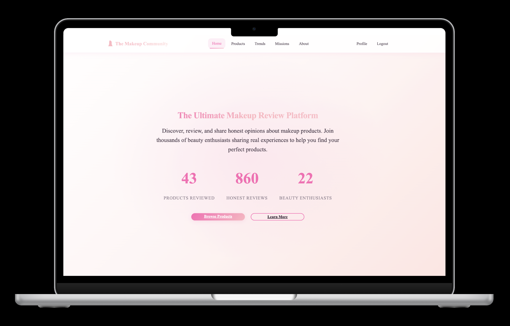

# The Makeup Community



## About
The Makeup Community is a review-first web app where users browse real makeup products and read/write honest reviews. It focuses on authenticity, clean design, and a friendly community experience.

- Discover trending products with real images
- Browse products and view consolidated details and reviews
- Create an account to write, edit, and delete your own reviews
- Profile page to see all your reviews

I built this to create a reliable place to research makeup with genuine community feedback.

## Getting Started
- Deployed app: [http://127.0.0.1:8000/](http://127.0.0.1:8000/) (local dev)
- Planning materials:

trello board: https://trello.com/b/qh6fYqqR/the-makeup-community

wireframe: https://www.canva.com/design/DAGyxIgZfVQ/CwO8MDOgMBjCqdVS8bbmrA/edit

ERD: https://www.canva.com/design/DAGyxd2i9BI/ATi3kDBJhsIWaCCQcfDXwQ/edit

Local setup:
```bash
cd my-community-project/makeuptutorial
pipenv install
pipenv run python manage.py migrate
pipenv run python seed.py
pipenv run python manage.py runserver
```

## Attributions
- Django and contrib packagesth
- Static product imagery added by the author
- Any third-party assets used belong to their respective owners

## Technologies Used
- Python 3, Django 5
- HTML, CSS (custom design system, glassmorphism touches)
- SQLite (dev)
- Pipenv for environment management

## Next Steps
- Public product submission/curation flow
- Improve search and filters (shades, undertones)
- Rich media in reviews with moderation queue
- User-to-user Q&A on product pages